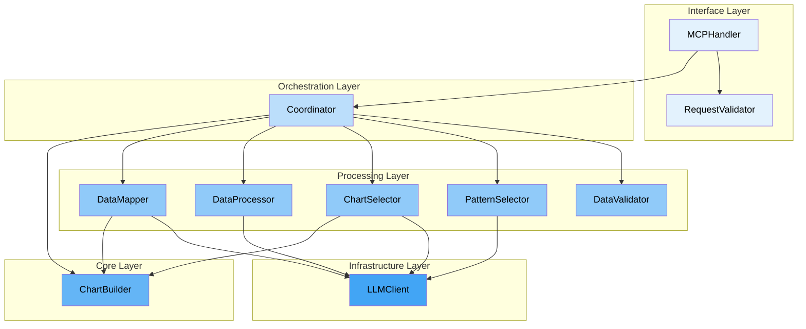
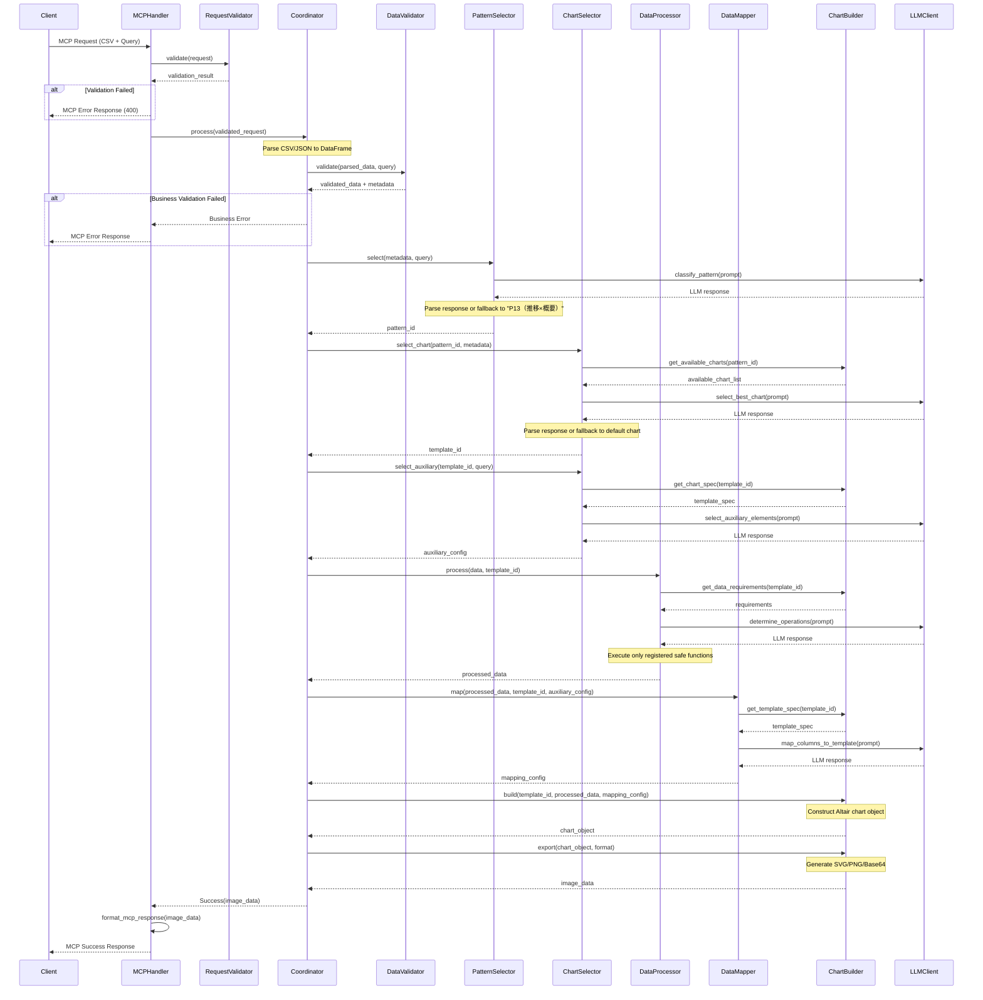

# Design Doc

*Version: 0.2 | Last Updated: 2025-09-06*

## 1. TL;DR

### 解決すべき課題

AIエージェントが生成するグラフは品質が不安定。LLMは視覚的検証ができないため、コードは正しくてもレンダリング結果に不具合が多発し、修正の反復でレイテンシとコスト増大。

### 推奨する設計方式

- 「制約付き有限状態アプローチ」によるMCP準拠可視化ツール：
- 可視化を3×3の9パターンに制約
- 事前検証済みのテンプレートのみ使用
- 完全ステートレス設計で任意コード実行を排除

### 予想される効果（実装する価値）

- 品質保証された可視化を10秒以内で確実に生成（成功率99.9%目標）
- セキュリティリスクなし（任意コード実行の排除）
- MCP/Function Calling準拠で既存AIエージェントに即統合可能

## 2. Context & Problem

### 2.1 背景

データ可視化は、複雑な情報を直感的に理解可能な形式に変換する重要な技術です。しかし、現在のデータ可視化環境には以下の構造的な課題が存在しています。

**品質保証の欠如**
多くの組織やツールで作成されるグラフには、軸ラベルの欠落、不適切なスケール選択、誤解を招く表現など、基本的な可視化原則に反する問題が散見されます。これらの問題は、意思決定の質を低下させ、データの誤解釈を招く原因となっています。

**アクセシビリティの壁**
既存の高品質な可視化ツール（Tableau、Power BI等）や可視化のベストプラクティスは確立されていますが、これらを適切に活用するには専門知識と経験が必要です。結果として、データリテラシーの高い専門家以外は、適切な可視化を実現することが困難な状況にあります。

**AI時代の新たな機会と課題**
生成AIとエージェント技術の急速な発展により、データ分析、レポート作成、プレゼンテーション資料の生成をAIが担う時代が到来しています。この変革は、AIが正しく美しいグラフを生成できれば、可視化品質の問題を大規模に解決できる可能性を示唆しています。

### 2.2 現状の技術的制約

現在のLLMベースのアプローチには、以下の技術的制約が存在します：

**視覚的検証の困難性**

- LLMは生成したグラフを視覚的に確認できないため、コード上は正しくても実際のレンダリング結果に不具合が生じる場合が多い
- 人間の視覚的フィードバックに依存した反復的な修正プロセスが必要
- 品質保証が困難で、一貫性のある高品質な出力を保証できない

**処理効率の課題**

- 任意のコード生成アプローチは、トークン消費量が増大し、レイテンシとコストが増加
- 複雑なコード生成は、セキュリティリスク（任意コード実行）を伴う
- エラー処理と修正のサイクルが長く、ユーザー体験を損なう

**既存ツール統合の限界**

- 既存のノーコードツールのMCP（Model Context Protocol）化では、選択肢の多さがAIの判断を複雑化
- プロプライエタリなツールは、オープンソースエコシステムへの統合が困難
- 視覚的確認が必要な操作が多く、完全自動化が困難

### 2.3 解決すべき核心的課題

本プロジェクトが解決を目指す核心的な課題は以下の通りです：

1. **品質の一貫性確保**：AIエージェントが生成するグラフの品質を、人間の介入なしに一貫して高水準に保つ仕組みの欠如
2. **制約と柔軟性のバランス**：AIが扱いやすい有限の選択肢と、多様な可視化ニーズへの対応を両立する設計の不在
3. **エコシステムへの統合性**：MCP準拠でオープンソースとして、様々なAIエージェントやツールから利用可能な可視化基盤の不足

### 2.4 なぜ今取り組むべきか

**市場機会の成熟**

- Claude Desktop、VSCode等のMCP対応ツールの普及により、標準化されたツール統合の基盤が整備
- エンタープライズ環境でのAIエージェント活用が本格化し、信頼性の高い可視化ツールへの需要が急増

**技術的タイミング**

- LLMの自然言語理解能力が、複雑な可視化意図の解釈に十分なレベルに到達
- MCP仕様の標準化により、エージェント間の相互運用性が確立

**競争優位性の確立**

- 制約ベースアプローチによる品質保証という独自の設計思想により、差別化された価値提供が可能
- オープンソースとして提供することで、エコシステムの標準ツールとしての地位確立が可能

### 2.5 提案するアプローチ

これらの課題に対し、本プロジェクトでは「**制約付き有限状態アプローチ**」を採用します：

- **事前検証済みテンプレート**：人間が品質を保証した限定的なテンプレートセットを使用
- **3×3マトリクス制約**：可視化パターンを9つの基本型に制約し、AIの判断を簡潔化
- **完全ステートレス設計**：各リクエストを独立処理し、複雑な状態管理を排除

このアプローチにより、AIエージェントが安定して高品質なグラフを生成できる、信頼性の高い可視化基盤の実現を目指します。

## 3. Goals / Non-Goals

### 3.1 Goals

### G1: AIエージェント向け可視化基盤の確立

- **MCP準拠の標準ツール提供**：Model Context Protocol仕様に完全準拠し、Claude Desktop、VSCode等の主要MCPクライアントから即座に利用可能な可視化ツールを実現する
- **Function Calling対応**：OpenAI/Anthropic仕様のFunction Callingに対応し、様々なAIエージェントフレームワークから統一的に利用可能な基盤を構築する
- **オープンソースエコシステムへの貢献**：MITライセンスでの公開により、AIエージェントコミュニティの標準可視化ツールとしての地位を確立する

### G2: 品質保証された可視化の実現

- **一貫した高品質出力**：事前検証済みテンプレートと3×3マトリクス制約により、AIが生成するすべてのグラフで一定以上の品質を保証する
- **可視化ベストプラクティスの自動適用**：軸ラベル、スケール、色選択等の可視化原則を自動的に適用し、誤解を招く表現を排除する
- **フェイルセーフ機構**：処理の各段階でフォールバック戦略を実装し、どのような入力に対しても有効な可視化を生成する

### G3: 自然言語による直感的な操作

- **意図理解の実現**：ユーザーの自然言語クエリから可視化の意図を正確に解釈し、適切なグラフタイプと表現を自動選択する
- **データ特性の自動認識**：入力データの型、分布、関係性を自動的に分析し、最適な可視化方法を提案する
- **コンテキスト適応**：分析の目的（推移確認、差異把握、概要理解等）に応じた適切な可視化を自動生成する

### G4: 高速・スケーラブルな処理

- **10秒以内のレスポンス**：P80で10秒以内の応答時間を実現し、インタラクティブな利用体験を提供する
- **完全ステートレス設計**：各リクエストを独立処理し、水平スケーリングによる処理能力の線形拡張を可能にする
- **並行処理対応**：最大100の同時リクエストを処理可能な並行処理機構を実装する

### G5: エンタープライズ対応の信頼性

- **99.9%の処理成功率**：有効な入力に対して99.9%以上の成功率を達成する（外部LLM障害を除く）
- **構造化エラー応答**：失敗時も構造化されたエラー情報と修正提案を提供し、AIエージェントの自律的な問題解決を支援する
- **監視・運用機能**：Prometheus形式のメトリクス、構造化ログ、OpenTelemetryトレーシングによる本番環境での運用性を確保する

### 3.2 Non-Goals

### NG1: 汎用可視化プラットフォームの構築

- **複雑な可視化要求への対応**：3Dグラフ、地理空間可視化、ネットワークグラフ等の特殊な可視化は対象外とする
- **インタラクティブ機能**：ズーム、パン、ドリルダウン等のインタラクティブな操作機能は実装しない
- **カスタムビジュアライゼーション**：ユーザー定義のカスタムグラフタイプやテンプレートの作成機能は提供しない

### NG2: データ管理・分析機能の提供

- **データストレージ**：入力データの永続化や履歴管理機能は実装しない
- **高度な統計分析**：予測分析、機械学習、高度な統計処理等のデータ分析機能は提供しない
- **データ変換パイプライン**：ETL処理や複雑なデータ変換ワークフローの構築機能は対象外とする

### NG3: エンドユーザー向けアプリケーション

- **スタンドアロンWebアプリ**：直接エンドユーザーが利用するWebアプリケーションは開発しない
- **ユーザー認証・管理**：ユーザーアカウント、権限管理、マルチテナント機能は実装しない
- **ダッシュボード機能**：複数グラフの組み合わせやリアルタイム更新ダッシュボードは提供しない

### NG4: 多様なデータ形式への対応

- **バイナリ形式のサポート**：Excel（.xlsx）、Parquet、Avro等のバイナリデータ形式は対象外とする
- **データベース直接接続**：SQL Database、NoSQL等への直接接続機能は提供しない
- **ストリーミングデータ**：リアルタイムデータストリームの処理や可視化は実装しない

### NG5: セッション・コンテキスト管理

- **会話の継続性**：複数リクエスト間でのコンテキスト保持や会話履歴管理は行わない
- **プログレッシブ可視化**：段階的な可視化の洗練や反復的な改善プロセスは提供しない
- **パーソナライゼーション**：ユーザーやエージェント固有の設定や学習機能は実装しない

### NG6: 任意コード実行

- **カスタムスクリプト実行**：ユーザー定義のPython/JavaScript等のコード実行機能は提供しない
- **動的テンプレート生成**：実行時の動的なテンプレート生成や修正機能は実装しない
- **プラグインシステム**：サードパーティ製プラグインやエクステンションの仕組みは構築しない

## 4. Information Architecture Design

### 4.1 可視化パターンマトリクス

本システムでは、可視化パターンを**第1意図 × 第2意図**の3×3マトリクスに制約します。

**第1意図（主目的）**：

- **推移（Transition）**: 時間的な変化を表現
- **差異（Difference）**: 要素間の比較を表現
- **概要（Overview）**: 全体像や分布を表現

**第2意図（補助目的）**：

- **なし（-）**: 単一の意図のみ
- **推移/差異/概要**: 第1意図と異なる補助意図を選択

### 4.2 9つのパターン定義

| Pattern ID | 第1意図 | 第2意図 | 用途 | グラフ例 |
| --- | --- | --- | --- | --- |
| P01 | 推移 | - | 単一系列の時間変化 | 折れ線グラフ |
| P02 | 差異 | - | カテゴリ間の比較 | 棒グラフ |
| P03 | 概要 | - | 分布や構成の把握 | ヒストグラム |
| P12 | 推移 | 差異 | 複数系列の時間変化比較 | 複数折れ線 |
| P13 | 推移 | 概要 | 分布の時間的変化（標準フォールバック） | ファセット×ヒストグラム |
| P21 | 差異 | 推移 | 差分の時間的変化 | グループ化棒グラフ |
| P23 | 差異 | 概要 | カテゴリ別の分布比較 | オーバーレイヒストグラム |
| P31 | 概要 | 推移 | 全体像の時間的変化 | Small multiples |
| P32 | 概要 | 差異 | 分布のカテゴリ間比較 | 並列箱ひげ図 |

### 4.3 補助要素

各パターンの基本グラフに対して適用可能な視覚的拡張要素を定義。補助要素は**グラフタイプごとに利用可能な要素を制約**し、視覚的整合性を保証します。

### 4.3.1 補助要素の分類

| カテゴリ | 要素ID | 要素名 | 説明 | 主な用途 |
| --- | --- | --- | --- | --- |
| データ強調 | highlight | ハイライト | 特定のデータポイントやシリーズを視覚的に強調 | 重要値、異常値、選択項目の強調 |
|  | annotation | 注釈 | データポイントに説明テキストを付与 | ピーク値、変化点、イベントの説明 |
|  | color_coding | 条件付き色分け | データ値に基づく動的な色の適用 | 閾値超過、カテゴリ分類、状態表示 |
| 参照線 | mean_line | 平均値線 | データセット全体の平均値を示す水平/垂直線 | 中心傾向の把握、基準値との比較 |
|  | median_line | 中央値線 | データの中央値を示す参照線 | 分布の中心把握、外れ値の影響除外 |
|  | target_line | 目標値線 | ビジネス目標やKPIを示す基準線 | 目標達成度、パフォーマンス評価 |
|  | threshold | 閾値帯 | 上限/下限の許容範囲を示す領域 | 正常範囲、警告レベル、安全域の表示 |
| トレンド表示 | regression | 回帰線 | データの全体的な傾向を示す近似線 | 成長率、相関関係、将来予測の基礎 |
|  | moving_avg | 移動平均線 | 短期変動を平滑化した推移 | ノイズ除去、基調判断、季節調整 |
|  | forecast | 予測線 | 将来の推定値を点線で表示 | 計画立案、需要予測、目標設定 |

### 4.3.2 適用方針

**グラフタイプ別の定義**：

- 各グラフタイプ（P01_line、P02_bar等）ごとに利用可能な補助要素を事前定義
- 視覚的に不適切な組み合わせを除外（例：面グラフへの回帰線）
- グラフあたり最大3要素までに制限

## 5. System Overview

### 5.1 アーキテクチャ概要



### 5.2 コンポーネント設計

### Interface Layer

- **MCPHandler**
    
    MCP準拠のリクエスト受信とレスポンス送信を担当。RequestValidatorを用いた形式検証の実行、検証済みリクエストのCoordinatorへの転送、MCPエラー仕様に準拠したエラーレスポンスの生成、PNG（Base64エンコード）/SVG（文字列）形式での画像レスポンスのフォーマットを実施。
    
- **RequestValidator**
    
    外部からのリクエストの形式的検証に特化した純粋関数的コンポーネント。必須フィールド（data, query）の存在確認、データ形式（CSV/JSON）の判定、サイズ制限（100MB）の確認、UTF-8エンコーディングの検証、クエリ文字数制限（1000文字）のチェックを実施。他コンポーネントへの依存なし。
    

### Orchestration Layer

- **Coordinator**
    
    可視化処理全体のワークフロー制御。CSV/JSON文字列のパース、各処理ステップの順次実行管理、エラー時のフォールバック戦略の決定、タイムアウト管理（60秒）、最終レスポンスの組み立てを担当。
    

### Processing Layer

- **DataValidator**
    
    入力データの構造的・意味的妥当性を検証。CSV/JSONの解析とデータフレーム変換、データ型の推論とメタデータ抽出（列数、行数、型情報）、欠損値・異常値の検出、可視化可能性の判定と制約チェックを実行。
    
- **PatternSelector**
    
    自然言語クエリとデータ特性から最適な可視化パターンを決定。3×3マトリクス（推移/差異/概要 × なし/推移/差異/概要）への分類、LLMを活用した意図解釈、フォールバック時の「P13（推移×概要）」パターンへの自動選択を実施。
    
- **ChartSelector**
    
    パターンとデータ特性から最適なグラフ種類と補助要素を選択。利用可能なグラフタイプの候補抽出、LLMを活用した最適なチャートタイプの決定、補助要素（トレンドライン、注釈等）の選択、フォールバック時の標準グラフ（折れ線）への自動選択を担当。
    
- **DataProcessor**
    
    選択されたグラフ要件に応じたデータの前処理実行。集計・フィルタリング・ソート・ピボット等の変換操作、時系列データの期間調整、外れ値処理、LLMによる必要な前処理操作の決定、登録済み関数のみを使用した安全な処理実行を担当。
    
- **DataMapper**
    
    処理済みデータとグラフテンプレートのエンコーディング要件のマッピング。データ列とテンプレート変数（x軸、y軸、色等）の対応付け、データ型とエンコーディング型の整合性確認、LLMを活用した最適なマッピング決定、必須フィールドの充足確認を実施。
    

### Core Layer

- **ChartBuilder**
    
    Altairベースのグラフテンプレート管理とレンダリング。各グラフ種別のビルダーメソッドの実装、パターンIDに対応する利用可能グラフリストの提供、テンプレート仕様と要件の定義、Altairチャートオブジェクトの構築、各種フォーマット（SVG/PNG/Vega-Lite）でのエクスポートを担当。
    

### Infrastructure Layer

- **LLMClient**
    
    外部LLM APIとの通信実装。OpenAI/Anthropic API仕様準拠の通信、認証とAPIキー管理、レート制限とリトライ制御、ネットワークエラーハンドリング、レスポンスストリーミング処理、共通メトリクス収集を担当。
    

### 5.3 シーケンス図



## 6. Component Details

### 6.1 Interface Layer

### MCPHandler

**責務**: MCP準拠のリクエスト受信・レスポンス送信とプロトコル変換

**IPO**:

- Input: MCPメッセージ（JSON-RPC形式）
- Process: プロトコル変換 → 検証委譲 → Coordinator呼び出し → レスポンス形式化
- Output: MCPレスポンス（画像データまたはエラー）

**設計判断**: Adapterパターンによるプロトコル分離

- MCP仕様の詳細を本レイヤーに隔離し、内部処理をプロトコル非依存に保つ
- Function Calling/REST APIへの将来的な拡張をハンドラー追加で実現
- エラー変換ロジックを一元化し、MCP仕様準拠を保証
- リクエストIDの管理とレスポンスの対応付けを明示的に実装

**クラス構造**:

```python
MCPHandler
├── handle() → MCPResponse          # エントリーポイント
├── _parse_mcp_request() → Dict     # JSON-RPC → 内部形式
├── _format_mcp_response() → Dict   # 内部形式 → JSON-RPC
├── _handle_error() → MCPError      # 例外 → MCP標準エラー
└── _encode_image() → str           # 画像データ → Base64/SVG文字列

MCPErrorCode (Enum)
├── INVALID_REQUEST = -32600
├── METHOD_NOT_FOUND = -32601
├── INVALID_PARAMS = -32602
├── INTERNAL_ERROR = -32603
└── APPLICATION_ERROR = -32500  # カスタムエラー用

```

**エラー処理方針**:

- 形式エラーは即座にMCPエラー応答（検証前段階）
- ビジネスエラーはAPPLICATION_ERRORコードでラップ
- タイムアウトは明示的なエラーメッセージで通知
- スタックトレースは本番環境では除外、開発環境のみ付与

### RequestValidator

**責務**: 形式的検証による不正リクエストの早期棄却

**IPO**:

- Input: `request: Dict`
- Process: スキーマ検証 → サイズ制限確認 → エンコーディング検証
- Output: `ValidatedRequest` または `ValidationError`

**設計判断**: Fail-fast原則による軽量検証

- ステートレス純粋関数として実装（依存性ゼロ）
- JSON Schema定義による宣言的検証
- 意味的検証は後段に委譲し、形式検証に特化
- 詳細なエラーメッセージで問題箇所を明示

**検証ルール**:

```python
VALIDATION_RULES = {
    'required_fields': ['data', 'query'],
    'data_constraints': {
        'max_size_mb': 100,
        'formats': ['csv', 'json'],
        'encoding': 'utf-8'
    },
    'query_constraints': {
        'max_length': 1000,
        'min_length': 1,
        'languages': ['ja', 'en']  # 日本語/英語対応
    },
    'options': {
        'format': ['png', 'svg'],
        'dpi': range(72, 301),
        'width': {'min': 400, 'max': 2000, 'default': 800},
        'height': {'min': 300, 'max': 2000, 'default': 600}
    }
}

```

**エラー処理方針**:

- 複数エラーを一度に報告（最初のエラーで停止しない）
- エラー詳細に修正方法のヒントを含める
- パフォーマンスのため大容量データは段階的検証
- UTF-8デコード失敗は明示的なエンコーディングエラーとして報告

### 6.2 Orchestration Layer

### Coordinator

**責務**: 可視化処理全体のワークフロー制御と各レイヤー間の調整

**IPO**:

- Input: `ValidatedRequest(data_raw: str, query: str, options?: Dict)`
- Process: データパース → 各処理ステップの順次実行 → タイムアウト管理
- Output: `VisualizationResult(image_data: Union[str, bytes], format: str, metadata: Dict)`

**設計判断**: Pipeline & Coordinatorパターンの採用

- 各処理ステップを独立したフェーズとして管理し、段階的フォールバックを実現
- 処理フェーズごとにタイムアウトを設定（全体60秒、個別10秒）
- エラー時は前フェーズの結果を利用した縮退運転を試行
- 状態遷移を明示的に管理し、監査ログとメトリクスを統一的に記録

**クラス構造**:

```python
Coordinator
├── process() → VisualizationResult  # メインエントリーポイント
├── _parse_data() → pd.DataFrame     # CSV/JSON → DataFrame変換
├── _execute_pipeline() → Dict       # 各ステップの順次実行
├── _handle_fallback() → Dict        # エラー時の縮退処理
└── _assemble_response() → VisualizationResult

PipelinePhase (Enum)
├── DATA_VALIDATION
├── PATTERN_SELECTION
├── CHART_SELECTION
├── DATA_PROCESSING
├── DATA_MAPPING
└── CHART_BUILDING

ProcessingContext  # 各フェーズ間で共有される処理コンテキスト
├── raw_data: pd.DataFrame
├── metadata: DataMetadata
├── pattern_id: Optional[str]
├── template_id: Optional[str]
├── processed_data: Optional[pd.DataFrame]
├── mapping_config: Optional[Dict]
├── auxiliary_config: Optional[List[str]]
├── warnings: List[str]
├── processing_time_ms: Dict[PipelinePhase, float]

```

**処理フロー制御**:

```python
PIPELINE_CONFIG = {
    PipelinePhase.DATA_VALIDATION: {
        'timeout': 5,
        'required': True,
        'fallback': None
    },
    PipelinePhase.PATTERN_SELECTION: {
        'timeout': 10,
        'required': False,
        'fallback': 'P13'  # 推移×概要（標準フォールバック）
    },
    PipelinePhase.CHART_SELECTION: {
        'timeout': 10,
        'required': False,
        'fallback': 'line_chart'  # 汎用折れ線
    },
    # ...
}

```

**エラー処理方針**:

- 必須フェーズ（データ検証）の失敗は即座にエラー応答
- 任意フェーズの失敗は事前定義されたフォールバック値で処理継続
- LLM依存フェーズのタイムアウト時は決定的デフォルト値を使用
- 各フェーズの失敗理由を記録し、最終応答のメタデータに含める
- チャート生成失敗時はエラー情報付きプレースホルダー画像を返却

**並行性制御**:

- 各リクエストは独立したCoordinatorインスタンスで処理（ステートレス）
- フェーズ内での並行実行は行わず、確定的な順次処理を保証
- 複数の補助要素選択など独立した処理のみ並行化を検討（将来拡張）

### 6.3 Processing Layer

### DataValidator

**責務**: 入力データの構造的妥当性を検証し可視化可能性を判定

**IPO**:

- Input: `data: pd.DataFrame`, `query: str`
- Process: データ型推論 → 統計的プロファイル生成 → 可視化制約チェック
- Output: `ValidatedData(df: pd.DataFrame, metadata: DataMetadata, warnings: List[str])`

**設計判断**: 段階的検証による早期失敗

- 必須条件（行列数制限、UTF-8）は即座に検証
- 警告は処理継続可能、エラーは即座に失敗
- セル数上限（1,000,000）超過時は自動サンプリング

**検証ルール**:

```python
DATA_CONSTRAINTS = {
    'max_cells': 1_000_000,  # 10,000行 × 100列
    'max_rows': 10_000,
    'max_columns': 100,
    'sampling_strategy': 'interval',  # 等間隔抽出
    'preserve_header': True
}

```

**エラー処理方針**:

- データ型不明な列は文字列として扱い警告を付与
- 10,000行超過時は決定論的等間隔サンプリング（警告付き）
- 完全に空のデータはエラーではなく単純グラフへフォールバック

### PatternSelector

**責務**: 自然言語クエリから3×3マトリクスパターンを選択

**IPO**:

- Input: `metadata: DataMetadata`, `query: str`
- Process: LLM意図分類（推移/差異/概要 × なし/推移/差異/概要）→ パターンID決定
- Output: `PatternSelection(pattern_id: str, reasoning: str)`

**設計判断**: 制約付きLLM活用

- プロンプトで9パターンの定義を明示し選択肢を制限
- Few-shotサンプルで分類精度を向上
- LLM応答の構造化JSONで確実なパース

**クラス構造**:

```python
PatternSelector
├── select() → PatternSelection
├── _build_prompt() → str  # メタデータとクエリから構造化プロンプト生成
├── _parse_response() → PatternSelection  # JSON応答パース
└── _fallback() → PatternSelection  # "P13: 推移×概要" への確定的フォールバック

```

**エラー処理方針**:

- LLMタイムアウト時は即座にP13パターン（最汎用）を選択
- 無効なパターンID応答時もP13へフォールバック
- パターンIDは2桁表記（P01〜P32）で統一

### ChartSelector

**責務**: パターンIDとデータ特性から最適グラフタイプと補助要素を決定

**IPO**:

- Input: `pattern_id: str`, `metadata: DataMetadata`, `query: str`
- Process: 候補グラフ抽出 → LLM選択 → 補助要素決定
- Output: `ChartSelection(template_id: str, auxiliary: List[str])`

**設計判断**: 二段階選択プロセス

- ChartBuilderから候補リストを取得し選択肢を制限
- グラフタイプと補助要素を独立して選択（結合度低減）
- テンプレートごとの補助要素制約を事前定義

**エラー処理方針**:

- 無効なtemplate_id時はパターンのデフォルトグラフを使用
- 補助要素の矛盾時は基本グラフのみで描画
- LLM失敗時は折れ線グラフへの決定的フォールバック

### DataProcessor

**責務**: テンプレート要件に基づくデータの前処理実行

**IPO**:

- Input: `data: pd.DataFrame`, `template_id: str`, `metadata: DataMetadata`
- Process: 要件取得 → 必要操作決定 → 登録関数実行
- Output: `ProcessedData(df: pd.DataFrame, operations_applied: List[str])`

**設計判断**: 宣言的処理パイプライン

- 登録済み安全関数のみ実行可能（任意コード実行を排除）
- 操作は冪等性を保証し再実行可能
- パイプライン定義をLLMが生成、実行は決定的

**登録関数例**:

```python
SAFE_OPERATIONS = {
    'groupby_agg': lambda df, by, agg: df.groupby(by).agg(agg),
    'filter': lambda df, condition: df.query(condition),
    'sort': lambda df, by: df.sort_values(by),
    'pivot': lambda df, **kwargs: df.pivot_table(**kwargs),
    'resample': lambda df, rule: df.resample(rule),
    'sample': lambda df, n: df.sample(n=n, random_state=42),  # 決定論的
    # 約20種類の基本操作
}

```

**エラー処理方針**:

- 未登録操作の要求時はスキップして警告
- 処理失敗時は元データを返却（可視化は継続）
- 必須前処理の失敗のみエラー化

### DataMapper

**責務**: データ列とテンプレート変数のマッピング決定

**IPO**:

- Input: `data: pd.DataFrame`, `template_spec: TemplateSpec`, `auxiliary_config: Dict`
- Process: 列型マッチング → LLMマッピング提案 → 制約検証
- Output: `MappingConfig(x: str, y: str, color?: str, size?: str, ...)`

**設計判断**: 型安全なマッピング

- テンプレート仕様の必須/任意フィールドを静的定義
- データ型とエンコーディング型の互換性を事前検証
- LLMは提案のみ、最終決定はルールベース検証

**検証ルール例**:

```python
ENCODING_CONSTRAINTS = {
    'x': {'temporal': ['datetime', 'date'], 'ordinal': ['int', 'float'], ...},
    'y': {'quantitative': ['int', 'float'], ...},
    'color': {'nominal': ['str', 'category'], 'ordinal': ['int'], ...},
}

```

**エラー処理方針**:

- 必須フィールドのマッピング失敗はエラー
- 任意フィールドは無視して基本可視化を保証
- 型不整合時は自動キャストを試行（警告付き）

### 6.4 Core Layer

### ChartBuilder

**責務**: 事前検証済みAltairテンプレートの管理とチャート生成

**IPO**:

- Input: `template_id: str`, `data: pd.DataFrame`, `mapping_config: Dict`, `auxiliary_config?: Dict`
- Process: テンプレート選択 → データバインディング → 補助要素適用 → Altairオブジェクト構築
- Output: `alt.Chart` または `bytes` (PNG/SVG)

**設計判断**: Strategyパターンによるテンプレート管理

- 約30種類のテンプレートを個別クラスとして実装
- `BaseTemplate`抽象クラスで共通処理（補助要素適用等）を集約
- 辞書による登録管理でシンプルな参照を実現
- 動的コード生成を排除し、静的テンプレートのパラメータ注入のみで制御

**クラス構造**:

```python
ChartBuilder
├── _templates: Dict[str, BaseTemplate]  # 30種類のテンプレート登録
├── build() → alt.Chart                  # テンプレート選択と委譲
├── get_available_charts() → List[ChartSpec]
├── get_template_spec() → TemplateSpec
└── export() → Union[str, bytes]

BaseTemplate (ABC)
├── build() → alt.Chart            # 抽象メソッド
├── apply_auxiliary() → alt.Chart  # 共通補助要素適用
└── validate_mapping() → bool      # 共通マッピング検証

LineTemplate, BarTemplate, etc. (各30種)
└── build() → alt.Chart  # 具体的なAltair実装

```

**エクスポート対応形式**:

- SVG（文字列）
- PNG（Base64エンコード）
- Vega-Lite（JSON仕様）

**エラー処理方針**:

- 無効なtemplate_idは可視化パターンごとに設定されたデフォルトグラフへフォールバック
- データ不整合時は最小限の可視化を保証
- レンダリング失敗時はエラーメッセージ付きプレースホルダー画像を返却

### 6.5 Infrastructure Layer

### LLMClient

**責務**: 外部LLM APIとの通信抽象化と横断的関心事の管理

**IPO**:

- Input: `messages: List[Dict]`, `model?: str`, `kwargs`
- Process: LiteLLMへの委譲 + 監査ログ記録
- Output: `LiteLLMResponse` (変換なし)

**設計判断**: LiteLLMの軽量ラッパーとして実装

- レスポンス形式の変換は行わず、LiteLLMの形式をそのまま使用
- 監査ログとメトリクス収集のみを追加
- Ollama/vLLMでのローカルモデルをサポート

## 7. Data Design

### 7.1 永続ストレージ方針

- **DBなし（完全ステートレス）**。プロセス内メモリのみ使用。
- 任意の入力データ・生成画像・LLMレスポンスは**レスポンス返却直後に破棄**。
- 例外：**揮発性LRUキャッシュ**（プロセス内、容量/TTLで制限）
    - 用途：クエリ→パターン分類結果、テンプレート仕様の参照結果
    - 前提：**可用性向上のみ**（永続性に依存しない）。

### 7.2 外部I/F用スキーマ（要約）

- **VisualizeRequest（共通）**
    - `data`: string （CSV/JSONの生文字列）
    - `query`: string（〜1000文字、ja/en）
    - `options`（任意）:
        - `format`: `"png"` | `"svg"`（default: `"png"`）
        - `dpi`: 72–300（default: 96）
        - `width`: 400–2000（default: 800）
        - `height`: 300–2000（default: 600）
        - `locale`: `"ja"` | `"en"`（メッセージ/ラベルに反映; 省略時は自動推定）
- **VisualizeResponse（成功）**
    - `format`: `"png"` | `"svg"`
    - `image`: string（PNG Base64 or SVG文字列）
    - `metadata`:
        - `pattern_id`: `"P01"〜"P32"`
        - `template_id`: string
        - `warnings`: string[]
        - `stats`: `{ rows, cols, sampled, duration_ms: {phase→ms} }`
        - `versions`: `{ api, templates, patterns }`
        - `fallback_applied`: boolean
- **ErrorResponse（失敗）**
    - `error`: `{ code, message, details?, hint?, correlation_id }`
    - `metadata`: `{ fallback_attempted: boolean, phase?: string }`

> JSON Schemaは /docs/api-reference.md に集約。ここでは上記の最小キー構成のみ示す。
> 

### 7.3 内部データモデル（サマリ）

- `ValidatedRequest`: { `df_format`: "csv"|"json", `raw_size_bytes`, `query`, `options` }
- `DataMetadata`: { `rows`, `cols`, `dtypes`: {col→type}, `has_datetime`, `has_category`, `null_ratio`: {col→0..1} }
- `PatternSelection`: { `pattern_id`, `reasoning?` }
- `ChartSelection`: { `template_id`, `auxiliary`: string[] }
- `ProcessedData`: { `df`, `operations_applied`: string[] }
- `MappingConfig`: { `x`, `y`, `color?`, `facet?`, `size?` … }
- `VisualizationResult`: { `image`, `format`, `metadata` }

> ログには生データを出力しない。記録はサイズ・カラム名・行列数・型要約まで。
> 

### 7.4 データライフサイクル

1. **受領**（MCP/REST/FC）→ 形式検証（Fail-fast）
2. **パース**（CSV/JSON→`DataFrame`）→ 型推論・プロファイリング（`DataMetadata`）
3. **縮退**（セル上限超過時：**決定論的等間隔サンプリング**）
4. **選択**（パターン/テンプレート/補助要素）
5. **前処理**（登録済み安全関数のみ）→ **マッピング**
6. **生成**（Altair→Vega-Lite→`vl-convert`等でPNG/SVG）
7. **返却**→ **即時破棄**（メモリクリア）
8. **監視情報のみ記録**（構造化ログ/メトリクス/トレース）

### 7.5 バージョニング

- `versions.api`: SemVer（例 `"0.2.0"`）
- `versions.templates`: テンプレートカタログのリビジョン（例 `"2025.01"`）
- `versions.patterns`: パターン定義の版（例 `"v1"`）

### 7.6 セキュリティ/プライバシー

- **PIIログ禁止**：値のサンプルやセル内容は**出力しない**。
- **Redaction**：クエリ文字列は最大長制限と**一部マスク**（数値以外の連続≥16文字はハッシュ化）。
- 伝送：TLS必須。保存：無。

## 8. Interface Design

本プロジェクトは**MCPツール**を主とし、将来拡張として**Function Calling**と**REST**を提供。

### 8.1 MCP Tool（主）

- **tool name**: `chartelier_visualize`
- **parameters**:
    
    ```json
    {
      "type": "object",
      "required": ["data", "query"],
      "properties": {
        "data": { "type": "string" },
        "query": { "type": "string", "maxLength": 1000 },
        "options": {
          "type": "object",
          "properties": {
            "format": { "enum": ["png", "svg"], "default": "png" },
            "dpi": { "type": "integer", "minimum": 72, "maximum": 300, "default": 96 },
            "width": { "type": "integer", "minimum": 400, "maximum": 2000, "default": 800 },
            "height": { "type": "integer", "minimum": 300, "maximum": 2000, "default": 600 },
            "locale": { "enum": ["ja", "en"] }
          }
        }
      }
    }
    
    ```
    
- **result**（成功時）:
    
    ```json
    {
      "format": "png",
      "image": "<base64>",
      "metadata": { "...": "..." }
    }
    
    ```
    
- **error**（MCP標準のerror.codeを使用。詳細は §9）

### 8.2 Function Calling（OpenAI/Anthropic）

- **function name**: `chartelier_visualize`
- **parameters**: MCPと同一スキーマ
- **戻り**: 成功→上記と同形式のJSON／失敗→標準エラー（`application_error`に詳細格納）

### 8.3 REST API（将来拡張）

- **POST** `/visualize`
    - **Request**: `application/json`（`VisualizeRequest`）
    - **200**:
        
        ```json
        { "format": "svg", "image": "<svg string>", "metadata": { "...": "..." } }
        
        ```
        
    - **4xx/5xx**:
        
        ```json
        { "error": { "code": "E422_UNPROCESSABLE", "message": "...", "hint": "...", "correlation_id": "..." } }
        
        ```
        
    - **Headers**:
        - `X-Chartelier-Request-Id`（相関ID）
        - `Cache-Control: no-store`（ステートレスで毎回処理）

> Message Queue／Webhook連携は現時点では非対応（省略）。
> 


## 9. Error Handling Design

### 9.1 エラー分類

| 階層 | 例 | HTTP | MCP JSON-RPC |
| --- | --- | --- | --- |
| Validation | 不正パラメータ、UTF-8不正、上限超過 | 400/413 | `-32602` |
| Business | 型不一致・必須マッピング欠落 | 422 | `-32500` |
| Upstream | LLM失敗・タイムアウト | 424/504 | `-32500` |
| System | 予期せぬ例外、レンダリング失敗 | 500 | `-32603` |
| Rate Limit | レート超過 | 429 | `-32500` |

### 9.2 エラーコード（`error.code`）

- `E400_VALIDATION`
- `E413_TOO_LARGE`
- `E415_UNSUPPORTED_FORMAT`
- `E422_UNPROCESSABLE`
- `E424_UPSTREAM_LLM`
- `E408_TIMEOUT`
- `E429_RATE_LIMITED`
- `E500_INTERNAL`
- `E503_DEPENDENCY_UNAVAILABLE`

### 9.3 返却ポリシー

- **言語**：`options.locale` または `query`の自動判定に基づき ja/en を選択。
- **ヒント**：**修正可能な提案**を常に含める（例：列名候補、型キャスト提案、サンプリング通知）。
- **フォールバック**：
    - LLM/テンプレート選択失敗 → **P13** で描画を試行
    - それでも失敗 → **エラープレースホルダー画像**（SVG）＋`E500_INTERNAL`

### 9.4 リトライ方針

- **LLM呼び出しのみ**：指数バックオフで最大**1回**。全体60秒上限内で実施。
- PNG/SVG生成の再試行は**1回**（フォーマットを切替えて再試行：PNG→SVG）。

### 9.5 ログ要件（エラー時）

- `level=ERROR`、`correlation_id`、`phase`、`pattern_id?`、`template_id?`、`rows/cols`、`fallback_applied`、`exception_class`
- メッセージ本文やデータ内容は**記録しない**。


## 10. Performance / Scalability Considerations

### 10.1 予算（P80 10秒内）

| フェーズ | 予算（ms） | 備考 |
| --- | --- | --- |
| 形式検証/パース | 1200 | CSVは`pandas`高速パース。大容量は段階読み。 |
| プロファイル/検証 | 500 | 型推論・統計サマリは軽量版。 |
| パターン選択（LLM） | 900 | 失敗で即P13。 |
| テンプレ選択+補助要素（LLM） | 900 | キャッシュヒット時は~50ms。 |
| 前処理 | 1500 | **登録済み関数のみ**。ベクトル化を優先。 |
| ビルド/エクスポート | 2500 | Altair→Vega-Lite→`vl-convert`推奨。 |
| マージン | 1500 | ネットワーク含む。 |

### 10.2 スケーリング

- **水平スケール**：Kubernetes HPA（CPU/レイテンシでスケール）。
- **コンカレンシー**：1プロセスあたり**同時最大N=8**（PNG生成はワーカープールで直列度調整）。
- **バックプレッシャ**：キュー長閾値超で**429**を返却。
- **メモリ上限制御**：
    - データフレームの**セル上限**（1,000,000）と**サンプリング**必須
    - `max_png_pixels = width × height ≤ 4,000,000` を超える場合は**縮退**（サイズ調整）

### 10.3 実装テクニック

- CSVは`dtype`ヒントで**推論コスト削減**。
- 日付列は明示フォーマット検出（`YYYY-MM-DD` 等）→失敗時は文字列として扱い**警告**。
- PNG導出は**`vl-convert`*（Rust実装）を優先、フォールバックでSVG返却可。
- LLMプロンプトは**短文化・定型化**（トークン節約、レイテンシ低減）。


## 11. Monitoring & Operations

### 11.1 メトリクス（Prometheus）

- `chartelier_requests_total{outcome, format, pattern_id, template_id}`
- `chartelier_request_duration_seconds_bucket{phase}`（Histogram）
- `chartelier_data_cells{bucket}`、`chartelier_sampling_applied_total`
- `chartelier_llm_calls_total{status}`、`chartelier_fallback_total{type}`
- `chartelier_errors_total{code}`

### 11.2 ログ（JSON構造化）

- 共通フィールド：`ts`, `level`, `correlation_id`, `phase`, `duration_ms`, `rows`, `cols`, `pattern_id?`, `template_id?`, `fallback_applied`
- **ペイロード不記録**。クエリは**ハッシュ/部分マスク**。

### 11.3 トレース（OpenTelemetry）

- スパン：`validate`, `profile`, `pattern_select`, `chart_select`, `preprocess`, `map`, `build`, `export`
- 属性：行列数、縮退発生、LLMキャッシュヒット、再試行回数
- サンプリング：**1%デフォルト**、5xx多発時は**10%**に一時引上げ（自動）。

### 11.4 健全性エンドポイント

- `GET /health`：Liveness（200固定）
- `GET /ready`：依存（LLM Key、`vl-convert`可用性、ワーカープール）チェック
- `GET /metrics`：Prometheus

### 11.5 運用フラグ（環境変数）

- `CHARTELIER_DISABLE_LLM=true` → 常時P13
- `CHARTELIER_FORCE_FORMAT=svg|png`
- `CHARTELIER_MAX_CONCURRENCY=8`
- `CHARTELIER_LOG_LEVEL=info|debug`

### 11.6 代表的インシデントと対処

- **PNG生成失敗の多発**：`FORCE_FORMAT=svg`で回避 → 後日`vl-convert`更新
- **LLM障害**：`DISABLE_LLM=true`でP13固定運転 → 復旧後に解除
- **レイテンシ劣化**：サンプリング閾値確認、テンプレ複雑度を削減（補助要素を最大1に一時制限）


## 12. Risks / Open Issues

### 12.1 リスク一覧（抜粋）

| リスク | 影響 | 兆候 | 対策 |
| --- | --- | --- | --- |
| **PNG導出依存**（`vl-convert`等） | 生成失敗/遅延 | 5xx増 | SVGフォールバック／CIでゴールデンイメージ比較 |
| **フォント問題（CJK）** | 文字化け | 文字欠落 | コンテナに Noto Sans/Noto Sans JP 同梱、SVGならフォント指定 |
| **LLMレイテンシ変動** | SLO逸脱 | P95↑ | キャッシュ／P13縮退／プロンプト短縮 |
| **9パターン限界** | 不満足な表現 | 迂回指示 | ユースケース収集→パターン追加をADRで管理 |
| **大容量データ** | OOM/遅延 | OOM/Kill | 等間隔サンプリング徹底・セル上限厳守 |
| **MCP仕様変動** | 互換性低下 | 取込失敗 | アダプタ層でバージョン分離・e2eテスト |

### 12.2 Open Issues

- **OI-001**: テンプレート数の初期上限（≈30）と維持コストの最適点
- **OI-002**: 色覚多様性対応の既定テーマ（ColorBrewer相当）を組込むか
- **OI-003**: `locale`と数値/日付フォーマットの細部（区切り・週起点）
- **OI-004**: RESTで**画像直返し**（`image/png`）を許可するか（現状はJSONラップ）
- **OI-005**: DataFrameエンジンの**pandas固定**か**Polars選択**可か（性能/互換）
